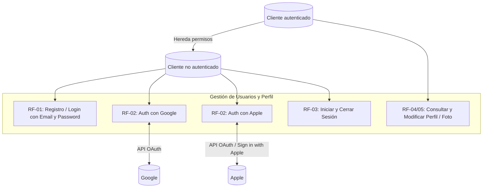
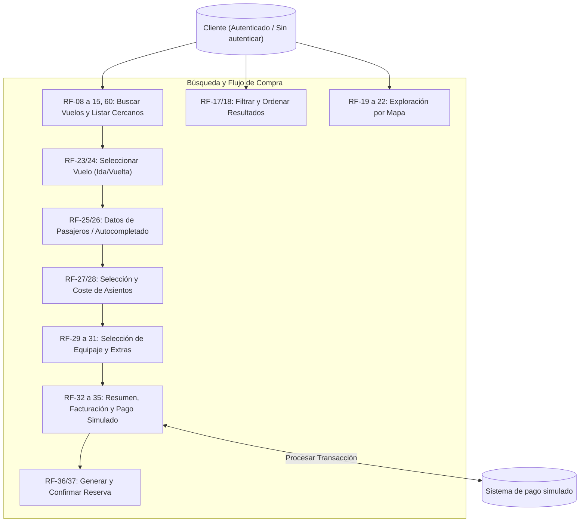
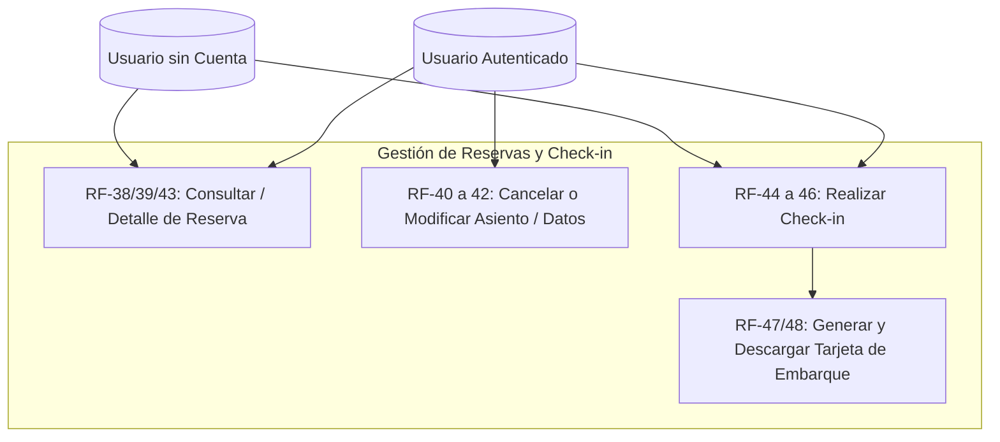
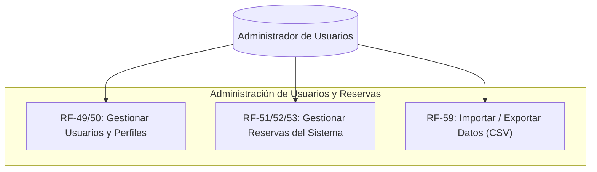
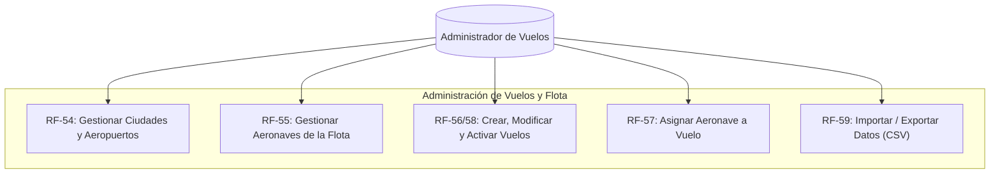

# Casos de Uso

## Autenticación, Usuarios y Perfil

## Búsqueda, Proceso de Reserva y Pago

## Gestión de Reservas y Check-in

## Panel de Administración de Gestión de Usuarios y Reservas

## Panel de Administración de Gestión de Vuelos y Flota

