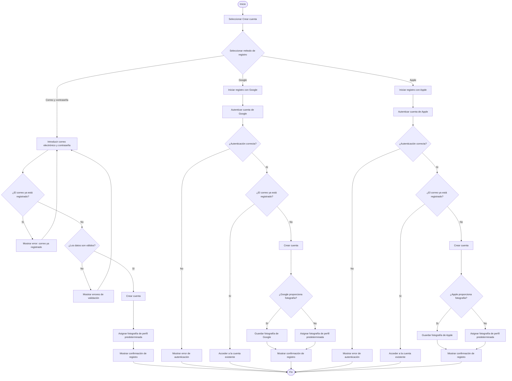
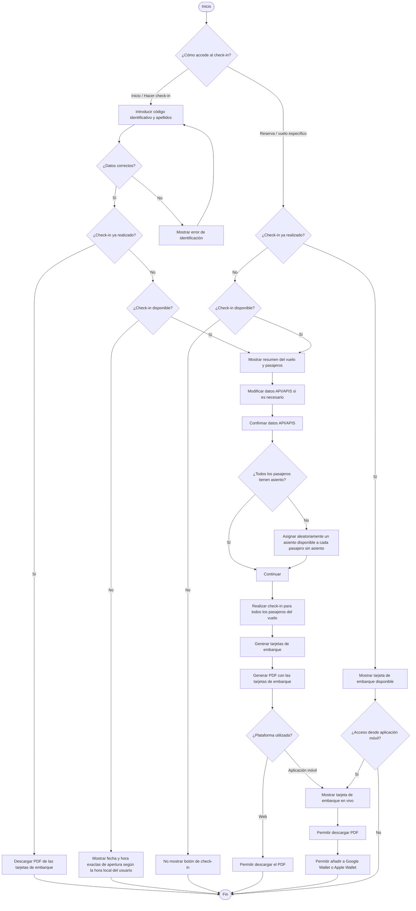

# Diagramas de Actividad

## Registro de un usuario

El siguiente diagrama representa el proceso de creación de una cuenta de usuario en Ilicitan Airlines mediante correo electrónico y contraseña, Google o Apple.

## Realización de una reserva

El siguiente diagrama representa el flujo principal que sigue un usuario para realizar una reserva en Ilicitan Airlines, desde la introducción de los criterios de búsqueda hasta la confirmación de la reserva.

```mermaid
flowchart TD
    A([Inicio]) --> B[Seleccionar tipo de viaje]
    B --> C[Seleccionar origen y destino]
    C --> D[Seleccionar fecha de salida]
    D --> E{¿Viaje de ida y vuelta?}
    E -->|Sí| F[Seleccionar fecha de regreso]
    E -->|No| G[Indicar número de pasajeros]
    F --> G
    G --> H[Seleccionar clase de viaje]
    H --> I[Buscar vuelos]
    I --> J{¿Hay vuelos disponibles?}
    J -->|No| K[Mostrar mensaje de que no hay vuelos]
    K --> Z([Fin])
    J -->|Sí| L[Mostrar vuelos disponibles]
    L --> M[Aplicar filtros u ordenar resultados]
    M --> N[Seleccionar vuelo de ida]
    N --> O{¿Viaje de ida y vuelta?}
    O -->|Sí| P[Seleccionar vuelo de regreso]
    O -->|No| Q[Introducir datos de los pasajeros]
    P --> Q
    Q --> R{¿Usuario autenticado?}
    R -->|Sí| S[Utilizar datos del perfil para rellenar pasajeros]
    R -->|No| T[Introducir datos manualmente]
    S --> U[Seleccionar asientos]
    T --> U
    U --> V{¿Asiento con coste adicional?}
    V -->|Sí| W[Calcular coste del asiento]
    V -->|No| X[Mantener precio del asiento]
    W --> Y[Gestionar equipaje]
    X --> Y
    Y --> AA{¿Añadir equipaje adicional?}
    AA -->|Sí| AB[Añadir equipaje facturado]
    AA -->|No| AC[Continuar]
    AB --> AC
    AC --> AD[Mostrar resumen de la reserva]
    AD --> AE[Introducir datos de facturación]
    AE --> AF[Seleccionar método de pago]
    AF --> AG[Realizar pago simulado]
    AG --> AH{¿Pago correcto?}
    AH -->|No| AI[Mostrar error de pago]
    AI --> AF
    AH -->|Sí| AJ[Crear y confirmar reserva]
    AJ --> AK[Mostrar confirmación]
    AK --> AL([Fin])
```

## Realización del check-in

El siguiente diagrama representa el proceso de check-in de Ilicitan Airlines, contemplando el acceso de usuarios registrados y no registrados, las diferentes ventanas de apertura según el tipo de vuelo, la gestión de pasajeros y asientos, la modificación de los datos API/APIS y la generación de las tarjetas de embarque.

