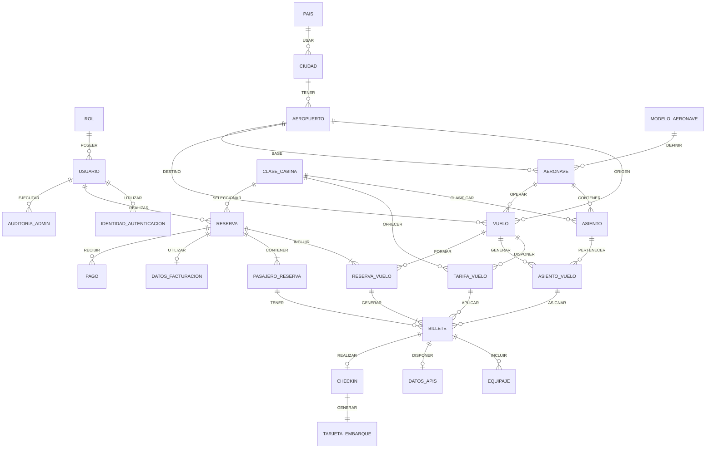

# Modelo de datos

## Diagrama EER



---

## Diccionario de datos

El diccionario de datos define los atributos que componen las entidades identificadas en el modelo EER, indicando su tipo, claves, restricciones y significado dentro del sistema.

### ROL

| Campo    | Tipo        | Clave | Nulo | Restricciones       | Descripción                |
| -------- | ----------- | ----- | ---- | ------------------- | -------------------------- |
| `id_rol` | INT         | PK    | No   | Identificador único | Identificador del rol      |
| `codigo` | VARCHAR(30) | UK    | No   | Único               | Código interno del rol     |
| `nombre` | VARCHAR(50) | —     | No   | —                   | Nombre descriptivo del rol |

### USUARIO

| Campo                | Tipo         | Clave | Nulo | Restricciones                        | Descripción                          |
| -------------------- | ------------ | ----- | ---- | ------------------------------------ | ------------------------------------ |
| `id_usuario`         | INT          | PK    | No   | Identificador único                  | Identificador del usuario            |
| `id_rol`             | INT          | FK    | No   | Referencia a `ROL`                   | Rol asignado al usuario              |
| `email`              | VARCHAR(255) | UK    | No   | Único                                | Correo electrónico del usuario       |
| `password_hash`      | VARCHAR(255) | —     | Sí   | Puede ser NULL para cuentas externas | Contraseña almacenada mediante hash  |
| `nombre`             | VARCHAR(100) | —     | No   | —                                    | Nombre del usuario                   |
| `apellidos`          | VARCHAR(150) | —     | No   | —                                    | Apellidos del usuario                |
| `telefono`           | VARCHAR(20)  | —     | Sí   | —                                    | Teléfono de contacto                 |
| `fecha_nacimiento`   | DATE         | —     | Sí   | —                                    | Fecha de nacimiento                  |
| `foto_url`           | VARCHAR(500) | —     | Sí   | —                                    | Dirección de la fotografía de perfil |
| `origen_foto`        | VARCHAR(20)  | —     | Sí   | `DEFAULT`, `GOOGLE`, `APPLE`, etc.   | Origen de la fotografía              |
| `activo`             | BOOLEAN      | —     | No   | Valor booleano                       | Indica si la cuenta está activa      |
| `fecha_creacion_utc` | DATETIME     | —     | No   | UTC                                  | Fecha de creación de la cuenta       |

### IDENTIDAD_AUTENTICACION

| Campo                   | Tipo         | Clave | Nulo | Restricciones            | Descripción                               |
| ----------------------- | ------------ | ----- | ---- | ------------------------ | ----------------------------------------- |
| `id_identidad`          | INT          | PK    | No   | Identificador único      | Identificador de la identidad             |
| `id_usuario`            | INT          | FK    | No   | Referencia a `USUARIO`   | Usuario al que pertenece la identidad     |
| `proveedor`             | VARCHAR(20)  | —     | No   | `GOOGLE` o `APPLE`       | Proveedor externo de autenticación        |
| `identificador_externo` | VARCHAR(255) | UK    | No   | Único junto al proveedor | Identificador del usuario en el proveedor |
| `email_proveedor`       | VARCHAR(255) | —     | Sí   | —                        | Correo proporcionado por el proveedor     |

Restricción recomendada: `UNIQUE(proveedor, identificador_externo)`.

### PAIS

| Campo         | Tipo         | Clave | Nulo | Restricciones       | Descripción                   |
| ------------- | ------------ | ----- | ---- | ------------------- | ----------------------------- |
| `id_pais`     | INT          | PK    | No   | Identificador único | Identificador del país        |
| `codigo_iso2` | CHAR(2)      | UK    | No   | ISO 3166-1 alpha-2  | Código ISO de dos caracteres  |
| `codigo_iso3` | CHAR(3)      | UK    | No   | ISO 3166-1 alpha-3  | Código ISO de tres caracteres |
| `nombre`      | VARCHAR(100) | —     | No   | —                   | Nombre del país               |

### CIUDAD

| Campo       | Tipo         | Clave | Nulo | Restricciones       | Descripción                     |
| ----------- | ------------ | ----- | ---- | ------------------- | ------------------------------- |
| `id_ciudad` | INT          | PK    | No   | Identificador único | Identificador de la ciudad      |
| `id_pais`   | INT          | FK    | No   | Referencia a `PAIS` | País al que pertenece la ciudad |
| `nombre`    | VARCHAR(100) | —     | No   | —                   | Nombre de la ciudad             |

Restricción recomendada: `UNIQUE(id_pais, nombre)`.

### AEROPUERTO

| Campo           | Tipo         | Clave | Nulo | Restricciones           | Descripción                                          |
| --------------- | ------------ | ----- | ---- | ----------------------- | ---------------------------------------------------- |
| `id_aeropuerto` | INT          | PK    | No   | Identificador único     | Identificador del aeropuerto                         |
| `id_ciudad`     | INT          | FK    | No   | Referencia a `CIUDAD`   | Ciudad en la que se encuentra                        |
| `codigo_iata`   | CHAR(3)      | UK    | No   | Código IATA             | Código IATA del aeropuerto                           |
| `nombre`        | VARCHAR(150) | —     | No   | —                       | Nombre del aeropuerto                                |
| `zona_horaria`  | VARCHAR(50)  | —     | No   | Identificador IANA      | Zona horaria del aeropuerto                          |
| `latitud`       | DECIMAL(9,6) | —     | No   | Rango geográfico válido | Latitud del aeropuerto                               |
| `longitud`      | DECIMAL(9,6) | —     | No   | Rango geográfico válido | Longitud del aeropuerto                              |
| `activo`        | BOOLEAN      | —     | No   | Valor booleano          | Indica si el aeropuerto está operativo en el sistema |

### MODELO_AERONAVE

| Campo                     | Tipo          | Clave | Nulo | Restricciones        | Descripción                             |
| ------------------------- | ------------- | ----- | ---- | -------------------- | --------------------------------------- |
| `id_modelo`               | INT           | PK    | No   | Identificador único  | Identificador del modelo                |
| `fabricante`              | VARCHAR(100)  | —     | No   | —                    | Fabricante de la aeronave               |
| `modelo`                  | VARCHAR(100)  | —     | No   | —                    | Modelo de la aeronave                   |
| `capacidad_maxima`        | INT           | —     | No   | Mayor que 0          | Capacidad máxima de pasajeros           |
| `capacidad_combustible_l` | DECIMAL(12,2) | —     | No   | Mayor que 0          | Capacidad de combustible en litros      |
| `peso_vacio_kg`           | DECIMAL(12,2) | —     | No   | Mayor que 0          | Peso de la aeronave vacía               |
| `peso_max_despegue_kg`    | DECIMAL(12,2) | —     | No   | Mayor que peso vacío | Peso máximo autorizado al despegue      |
| `alcance_km`              | INT           | —     | No   | Mayor que 0          | Alcance máximo aproximado en kilómetros |
| `activo`                  | BOOLEAN       | —     | No   | Valor booleano       | Indica si el modelo está disponible     |

### AERONAVE

| Campo                | Tipo         | Clave | Nulo | Restricciones                  | Descripción                              |
| -------------------- | ------------ | ----- | ---- | ------------------------------ | ---------------------------------------- |
| `id_aeronave`        | INT          | PK    | No   | Identificador único            | Identificador de la aeronave             |
| `id_modelo`          | INT          | FK    | No   | Referencia a `MODELO_AERONAVE` | Modelo al que pertenece                  |
| `id_aeropuerto_base` | INT          | FK    | Sí   | Referencia a `AEROPUERTO`      | Aeropuerto base de la aeronave           |
| `matricula`          | VARCHAR(20)  | UK    | No   | Única                          | Matrícula de la aeronave                 |
| `nombre`             | VARCHAR(100) | —     | Sí   | —                              | Nombre identificativo de la aeronave     |
| `estado`             | VARCHAR(30)  | —     | No   | Valores controlados            | Estado operativo                         |
| `fecha_alta`         | DATE         | —     | No   | —                              | Fecha de incorporación a la flota        |
| `activo`             | BOOLEAN      | —     | No   | Valor booleano                 | Indica si forma parte de la flota activa |

### CLASE_CABINA

| Campo      | Tipo        | Clave | Nulo | Restricciones       | Descripción                  |
| ---------- | ----------- | ----- | ---- | ------------------- | ---------------------------- |
| `id_clase` | INT         | PK    | No   | Identificador único | Identificador de la clase    |
| `codigo`   | VARCHAR(20) | UK    | No   | Único               | Código de la clase           |
| `nombre`   | VARCHAR(50) | —     | No   | —                   | Nombre de la clase de cabina |

### ASIENTO

| Campo               | Tipo        | Clave | Nulo | Restricciones                    | Descripción                                              |
| ------------------- | ----------- | ----- | ---- | -------------------------------- | -------------------------------------------------------- |
| `id_asiento`        | INT         | PK    | No   | Identificador único              | Identificador del asiento                                |
| `id_aeronave`       | INT         | FK    | No   | Referencia a `AERONAVE`          | Aeronave a la que pertenece                              |
| `id_clase`          | INT         | FK    | No   | Referencia a `CLASE_CABINA`      | Clase de cabina del asiento                              |
| `fila`              | INT         | —     | No   | Mayor que 0                      | Número de fila                                           |
| `letra`             | CHAR(1)     | —     | No   | Valor válido según configuración | Letra del asiento                                        |
| `tipo`              | VARCHAR(30) | —     | No   | Valores controlados              | Tipo de asiento                                          |
| `salida_emergencia` | BOOLEAN     | —     | No   | Valor booleano                   | Indica si está situado en una salida de emergencia       |
| `activo`            | BOOLEAN     | —     | No   | Valor booleano                   | Indica si el asiento está disponible en la configuración |

Restricción recomendada: `UNIQUE(id_aeronave, fila, letra)`.

### VUELO

| Campo              | Tipo        | Clave | Nulo | Restricciones             | Descripción                                      |
| ------------------ | ----------- | ----- | ---- | ------------------------- | ------------------------------------------------ |
| `id_vuelo`         | INT         | PK    | No   | Identificador único       | Identificador del vuelo                          |
| `id_origen`        | INT         | FK    | No   | Referencia a `AEROPUERTO` | Aeropuerto de origen                             |
| `id_destino`       | INT         | FK    | No   | Referencia a `AEROPUERTO` | Aeropuerto de destino                            |
| `id_aeronave`      | INT         | FK    | No   | Referencia a `AERONAVE`   | Aeronave asignada al vuelo                       |
| `numero_vuelo`     | VARCHAR(10) | —     | No   | —                         | Número comercial del vuelo                       |
| `salida_utc`       | DATETIME    | —     | No   | UTC                       | Fecha y hora de salida                           |
| `llegada_utc`      | DATETIME    | —     | No   | UTC                       | Fecha y hora de llegada                          |
| `estado`           | VARCHAR(30) | —     | No   | Valores controlados       | Estado operativo del vuelo                       |
| `venta_habilitada` | BOOLEAN     | —     | No   | Valor booleano            | Indica si el vuelo está disponible para su venta |

Restricciones recomendadas: origen y destino deben ser distintos y `llegada_utc` debe ser posterior a `salida_utc`.

### TARIFA_VUELO

| Campo                        | Tipo          | Clave | Nulo | Restricciones               | Descripción                                    |
| ---------------------------- | ------------- | ----- | ---- | --------------------------- | ---------------------------------------------- |
| `id_tarifa`                  | INT           | PK    | No   | Identificador único         | Identificador de la tarifa                     |
| `id_vuelo`                   | INT           | FK    | No   | Referencia a `VUELO`        | Vuelo al que pertenece                         |
| `id_clase`                   | INT           | FK    | No   | Referencia a `CLASE_CABINA` | Clase asociada                                 |
| `precio_base`                | DECIMAL(10,2) | —     | No   | Mayor o igual que 0         | Precio base de la tarifa                       |
| `moneda`                     | CHAR(3)       | —     | No   | ISO 4217                    | Moneda del precio                              |
| `permite_cancelacion`        | BOOLEAN       | —     | No   | Valor booleano              | Indica si admite cancelación                   |
| `permite_cambio`             | BOOLEAN       | —     | No   | Valor booleano              | Indica si admite cambios                       |
| `equipaje_mano_piezas`       | TINYINT       | —     | No   | Mayor o igual que 0         | Número de piezas de equipaje de mano incluidas |
| `equipaje_facturado_piezas`  | TINYINT       | —     | No   | Mayor o igual que 0         | Número de piezas facturadas incluidas          |
| `peso_equipaje_facturado_kg` | DECIMAL(5,2)  | —     | No   | Mayor o igual que 0         | Peso máximo de equipaje facturado incluido     |
| `activa`                     | BOOLEAN       | —     | No   | Valor booleano              | Indica si la tarifa está disponible            |

Restricción recomendada: `UNIQUE(id_vuelo, id_clase)`.

### ASIENTO_VUELO

| Campo              | Tipo          | Clave | Nulo | Restricciones          | Descripción                                                |
| ------------------ | ------------- | ----- | ---- | ---------------------- | ---------------------------------------------------------- |
| `id_asiento_vuelo` | INT           | PK    | No   | Identificador único    | Identificador de la disponibilidad del asiento en el vuelo |
| `id_vuelo`         | INT           | FK    | No   | Referencia a `VUELO`   | Vuelo al que pertenece                                     |
| `id_asiento`       | INT           | FK    | No   | Referencia a `ASIENTO` | Asiento físico de la aeronave                              |
| `estado`           | VARCHAR(20)   | —     | No   | Valores controlados    | Estado del asiento para ese vuelo                          |
| `precio_extra`     | DECIMAL(10,2) | —     | No   | Mayor o igual que 0    | Coste adicional del asiento                                |

Restricción recomendada: `UNIQUE(id_vuelo, id_asiento)`.

### RESERVA

| Campo                | Tipo          | Clave | Nulo | Restricciones                   | Descripción                        |
| -------------------- | ------------- | ----- | ---- | ------------------------------- | ---------------------------------- |
| `id_reserva`         | INT           | PK    | No   | Identificador único             | Identificador de la reserva        |
| `id_usuario`         | INT           | FK    | Sí   | NULL para reservas de invitados | Usuario propietario de la reserva  |
| `id_clase`           | INT           | FK    | No   | Referencia a `CLASE_CABINA`     | Clase seleccionada para la reserva |
| `codigo_reserva`     | VARCHAR(20)   | UK    | No   | Único                           | Localizador de la reserva          |
| `tipo_viaje`         | VARCHAR(20)   | —     | No   | `IDA` o `IDA_VUELTA`            | Tipo de viaje                      |
| `email_contacto`     | VARCHAR(255)  | —     | No   | Formato de correo               | Correo de contacto de la reserva   |
| `telefono_contacto`  | VARCHAR(20)   | Sí    | —    | —                               | Teléfono de contacto               |
| `estado`             | VARCHAR(30)   | —     | No   | Valores controlados             | Estado de la reserva               |
| `importe_total`      | DECIMAL(10,2) | —     | No   | Mayor o igual que 0             | Importe total de la reserva        |
| `moneda`             | CHAR(3)       | —     | No   | ISO 4217                        | Moneda utilizada                   |
| `fecha_creacion_utc` | DATETIME      | —     | No   | UTC                             | Fecha de creación                  |

### RESERVA_VUELO

| Campo              | Tipo        | Clave | Nulo | Restricciones          | Descripción                           |
| ------------------ | ----------- | ----- | ---- | ---------------------- | ------------------------------------- |
| `id_reserva_vuelo` | INT         | PK    | No   | Identificador único    | Identificador del tramo de la reserva |
| `id_reserva`       | INT         | FK    | No   | Referencia a `RESERVA` | Reserva a la que pertenece            |
| `id_vuelo`         | INT         | FK    | No   | Referencia a `VUELO`   | Vuelo incluido                        |
| `orden`            | TINYINT     | —     | No   | 1 o 2                  | Orden del tramo dentro de la reserva  |
| `tipo_tramo`       | VARCHAR(20) | —     | No   | `IDA` o `VUELTA`       | Tipo de tramo                         |

### PASAJERO_RESERVA

| Campo                 | Tipo         | Clave | Nulo | Restricciones            | Descripción                                             |
| --------------------- | ------------ | ----- | ---- | ------------------------ | ------------------------------------------------------- |
| `id_pasajero_reserva` | INT          | PK    | No   | Identificador único      | Identificador del pasajero dentro de la reserva         |
| `id_reserva`          | INT          | FK    | No   | Referencia a `RESERVA`   | Reserva a la que pertenece                              |
| `numero_pasajero`     | TINYINT      | —     | No   | Entre 1 y 8              | Número identificativo del pasajero dentro de la reserva |
| `tipo_pasajero`       | VARCHAR(20)  | —     | No   | `ADULTO`, `NINO`, `BEBE` | Categoría del pasajero                                  |
| `nombre`              | VARCHAR(100) | —     | No   | —                        | Nombre del pasajero                                     |
| `apellidos`           | VARCHAR(150) | —     | No   | —                        | Apellidos del pasajero                                  |
| `fecha_nacimiento`    | DATE         | —     | No   | —                        | Fecha de nacimiento                                     |
| `nacionalidad`        | CHAR(2)      | —     | Sí   | Código ISO               | Nacionalidad del pasajero                               |

Restricción recomendada: `UNIQUE(id_reserva, numero_pasajero)`.

### BILLETE

| Campo                 | Tipo          | Clave | Nulo | Restricciones                   | Descripción                         |
| --------------------- | ------------- | ----- | ---- | ------------------------------- | ----------------------------------- |
| `id_billete`          | INT           | PK    | No   | Identificador único             | Identificador del billete           |
| `id_reserva_vuelo`    | INT           | FK    | No   | Referencia a `RESERVA_VUELO`    | Tramo de reserva al que pertenece   |
| `id_pasajero_reserva` | INT           | FK    | No   | Referencia a `PASAJERO_RESERVA` | Pasajero asociado                   |
| `id_tarifa`           | INT           | FK    | No   | Referencia a `TARIFA_VUELO`     | Tarifa aplicada                     |
| `id_asiento_vuelo`    | INT           | FK    | Sí   | Puede asignarse posteriormente  | Asiento asignado para el vuelo      |
| `codigo_billete`      | VARCHAR(30)   | UK    | No   | Único                           | Identificador comercial del billete |
| `precio_base`         | DECIMAL(10,2) | —     | No   | Mayor o igual que 0             | Precio base aplicado al billete     |
| `estado`              | VARCHAR(30)   | —     | No   | Valores controlados             | Estado del billete                  |

### EQUIPAJE

| Campo         | Tipo          | Clave | Nulo | Restricciones          | Descripción                |
| ------------- | ------------- | ----- | ---- | ---------------------- | -------------------------- |
| `id_equipaje` | INT           | PK    | No   | Identificador único    | Identificador del equipaje |
| `id_billete`  | INT           | FK    | No   | Referencia a `BILLETE` | Billete al que pertenece   |
| `tipo`        | VARCHAR(30)   | —     | No   | Valores controlados    | Tipo de equipaje           |
| `peso_kg`     | DECIMAL(5,2)  | —     | No   | Mayor que 0            | Peso del equipaje          |
| `precio`      | DECIMAL(10,2) | —     | No   | Mayor o igual que 0    | Precio asociado            |

### DATOS_APIS

| Campo                     | Tipo         | Clave | Nulo | Restricciones        | Descripción                         |
| ------------------------- | ------------ | ----- | ---- | -------------------- | ----------------------------------- |
| `id_apis`                 | INT          | PK    | No   | Identificador único  | Identificador de los datos APIS     |
| `id_billete`              | INT          | FK    | No   | Único                | Billete asociado                    |
| `tipo_documento`          | VARCHAR(30)  | —     | No   | Valores controlados  | Tipo de documento utilizado         |
| `numero_documento`        | VARCHAR(50)  | —     | No   | —                    | Número del documento                |
| `pais_emision`            | CHAR(2)      | —     | No   | Código ISO           | País emisor                         |
| `fecha_caducidad`         | DATE         | No    | —    | Fecha válida         | Fecha de caducidad del documento    |
| `sexo`                    | CHAR(1)      | —     | Sí   | Valores establecidos | Sexo indicado en el documento       |
| `pais_residencia`         | CHAR(2)      | —     | Sí   | Código ISO           | País de residencia                  |
| `direccion_destino`       | VARCHAR(255) | —     | Sí   | —                    | Dirección de destino declarada      |
| `fecha_actualizacion_utc` | DATETIME     | —     | No   | UTC                  | Fecha de actualización de los datos |

### CHECKIN

| Campo               | Tipo     | Clave | Nulo | Restricciones       | Descripción                                   |
| ------------------- | -------- | ----- | ---- | ------------------- | --------------------------------------------- |
| `id_checkin`        | INT      | PK    | No   | Identificador único | Identificador del check-in                    |
| `id_billete`        | INT      | FK    | No   | Único               | Billete que realiza el check-in               |
| `fecha_checkin_utc` | DATETIME | —     | No   | UTC                 | Fecha y hora en la que se realiza el check-in |

Restricción recomendada: `UNIQUE(id_billete)`.

### TARJETA_EMBARQUE

| Campo               | Tipo         | Clave | Nulo | Restricciones       | Descripción                                  |
| ------------------- | ------------ | ----- | ---- | ------------------- | -------------------------------------------- |
| `id_tarjeta`        | INT          | PK    | No   | Identificador único | Identificador de la tarjeta de embarque      |
| `id_checkin`        | INT          | FK    | No   | Único               | Check-in que generó la tarjeta               |
| `codigo_barra`      | VARCHAR(255) | UK    | No   | Único               | Código utilizado para identificar la tarjeta |
| `fecha_emision_utc` | DATETIME     | —     | No   | UTC                 | Fecha de emisión                             |

Restricción recomendada: `UNIQUE(id_checkin)`.

### DATOS_FACTURACION

| Campo                   | Tipo         | Clave | Nulo | Restricciones       | Descripción                               |
| ----------------------- | ------------ | ----- | ---- | ------------------- | ----------------------------------------- |
| `id_facturacion`        | INT          | PK    | No   | Identificador único | Identificador de los datos de facturación |
| `id_reserva`            | INT          | FK    | No   | Único               | Reserva a la que pertenece                |
| `nombre_razon_social`   | VARCHAR(150) | —     | No   | —                   | Nombre o razón social                     |
| `identificacion_fiscal` | VARCHAR(50)  | —     | No   | —                   | Identificación fiscal                     |
| `direccion`             | VARCHAR(255) | —     | No   | —                   | Dirección de facturación                  |
| `codigo_postal`         | VARCHAR(15)  | —     | No   | —                   | Código postal                             |
| `ciudad`                | VARCHAR(100) | —     | No   | —                   | Ciudad de facturación                     |
| `pais`                  | VARCHAR(100) | —     | No   | —                   | País de facturación                       |

### PAGO

| Campo                    | Tipo          | Clave | Nulo | Restricciones          | Descripción                    |
| ------------------------ | ------------- | ----- | ---- | ---------------------- | ------------------------------ |
| `id_pago`                | INT           | PK    | No   | Identificador único    | Identificador del pago         |
| `id_reserva`             | INT           | FK    | No   | Referencia a `RESERVA` | Reserva asociada               |
| `metodo`                 | VARCHAR(30)   | —     | No   | Valores controlados    | Método de pago utilizado       |
| `importe`                | DECIMAL(10,2) | —     | No   | Mayor que 0            | Importe del pago               |
| `moneda`                 | CHAR(3)       | —     | No   | ISO 4217               | Moneda del pago                |
| `estado`                 | VARCHAR(30)   | —     | No   | Valores controlados    | Estado del pago                |
| `referencia`             | VARCHAR(100)  | UK    | No   | Única                  | Referencia de la operación     |
| `fecha_creacion_utc`     | DATETIME      | —     | No   | UTC                    | Fecha de creación del pago     |
| `fecha_confirmacion_utc` | DATETIME      | Sí    | —    | UTC                    | Fecha de confirmación del pago |

### AUDITORIA_ADMIN

| Campo          | Tipo        | Clave | Nulo | Restricciones             | Descripción                             |
| -------------- | ----------- | ----- | ---- | ------------------------- | --------------------------------------- |
| `id_auditoria` | INT         | PK    | No   | Identificador único       | Identificador del registro de auditoría |
| `id_usuario`   | INT         | FK    | No   | Referencia a `USUARIO`    | Administrador que realizó la operación  |
| `accion`       | VARCHAR(50) | —     | No   | Valores controlados       | Acción realizada                        |
| `entidad`      | VARCHAR(50) | —     | No   | —                         | Entidad afectada                        |
| `id_entidad`   | INT         | —     | No   | Identificador de registro | Identificador del registro afectado     |
| `fecha_utc`    | DATETIME    | —     | No   | UTC                       | Fecha y hora de la operación            |
| `detalle`      | TEXT        | Sí    | —    | —                         | Información adicional de la operación   |

```

Una precisión importante: **este diccionario ya está a un nivel mucho más próximo al modelo físico que el EER**, porque aparecen `VARCHAR`, `DECIMAL`, `DATETIME`, longitudes y restricciones. Eso es correcto para documentarlo como diccionario de datos.

Además, al revisar el modelo contra tus requisitos, hay dos puntos que conviene reflejar también cuando actualicemos el EER definitivo: las **reservas de invitado** hacen que la relación `USUARIO–RESERVA` sea opcional, y el **asiento de un billete puede quedar sin asignar hasta el check-in**.
```
