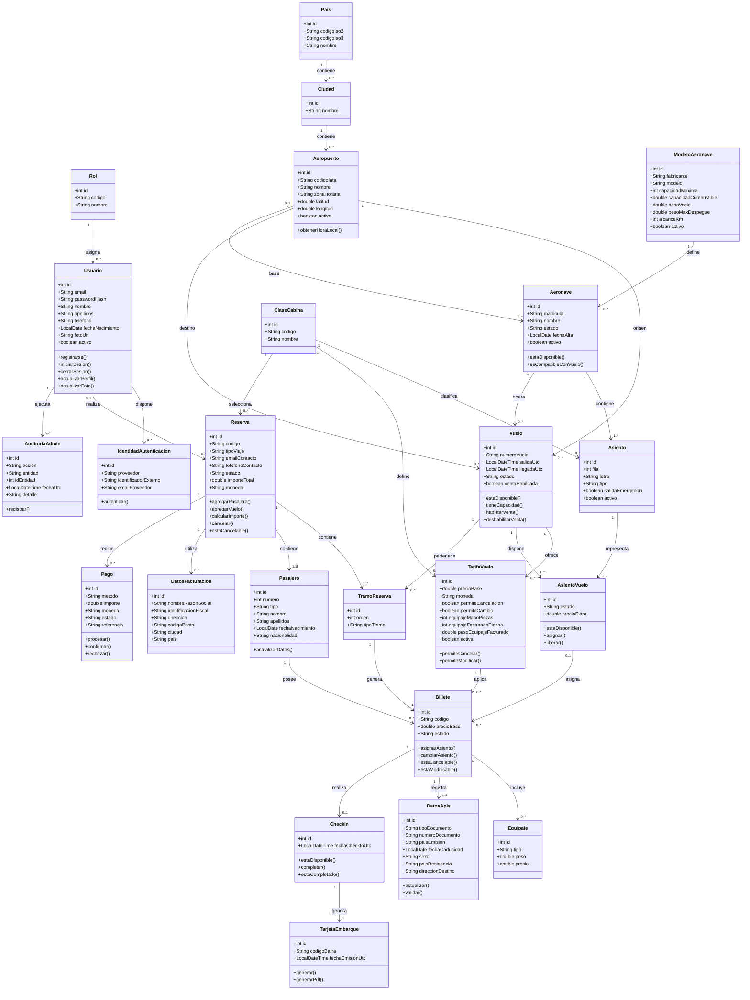

# Diagrama de clases

```mermaid
classDiagram

    class Rol {
        +int id
        +String codigo
        +String nombre
    }

    class Usuario {
        +int id
        +String email
        +String passwordHash
        +String nombre
        +String apellidos
        +String telefono
        +LocalDate fechaNacimiento
        +String fotoUrl
        +boolean activo
        +registrarse()
        +iniciarSesion()
        +cerrarSesion()
        +actualizarPerfil()
        +actualizarFoto()
    }

    class IdentidadAutenticacion {
        +int id
        +String proveedor
        +String identificadorExterno
        +String emailProveedor
        +autenticar()
    }

    class Pais {
        +int id
        +String codigoIso2
        +String codigoIso3
        +String nombre
    }

    class Ciudad {
        +int id
        +String nombre
    }

    class Aeropuerto {
        +int id
        +String codigoIata
        +String nombre
        +String zonaHoraria
        +double latitud
        +double longitud
        +boolean activo
        +obtenerHoraLocal()
    }

    class ModeloAeronave {
        +int id
        +String fabricante
        +String modelo
        +int capacidadMaxima
        +double capacidadCombustible
        +double pesoVacio
        +double pesoMaxDespegue
        +int alcanceKm
        +boolean activo
    }

    class Aeronave {
        +int id
        +String matricula
        +String nombre
        +String estado
        +LocalDate fechaAlta
        +boolean activo
        +estaDisponible()
        +esCompatibleConVuelo()
    }

    class ClaseCabina {
        +int id
        +String codigo
        +String nombre
    }

    class Asiento {
        +int id
        +int fila
        +String letra
        +String tipo
        +boolean salidaEmergencia
        +boolean activo
    }

    class Vuelo {
        +int id
        +String numeroVuelo
        +LocalDateTime salidaUtc
        +LocalDateTime llegadaUtc
        +String estado
        +boolean ventaHabilitada
        +estaDisponible()
        +tieneCapacidad()
        +habilitarVenta()
        +deshabilitarVenta()
    }

    class TarifaVuelo {
        +int id
        +double precioBase
        +String moneda
        +boolean permiteCancelacion
        +boolean permiteCambio
        +int equipajeManoPiezas
        +int equipajeFacturadoPiezas
        +double pesoEquipajeFacturado
        +boolean activa
        +permiteCancelar()
        +permiteModificar()
    }

    class AsientoVuelo {
        +int id
        +String estado
        +double precioExtra
        +estaDisponible()
        +asignar()
        +liberar()
    }

    class Reserva {
        +int id
        +String codigo
        +String tipoViaje
        +String emailContacto
        +String telefonoContacto
        +String estado
        +double importeTotal
        +String moneda
        +agregarPasajero()
        +agregarVuelo()
        +calcularImporte()
        +cancelar()
        +estaCancelable()
    }

    class TramoReserva {
        +int id
        +int orden
        +String tipoTramo
    }

    class Pasajero {
        +int id
        +int numero
        +String tipo
        +String nombre
        +String apellidos
        +LocalDate fechaNacimiento
        +String nacionalidad
        +actualizarDatos()
    }

    class Billete {
        +int id
        +String codigo
        +double precioBase
        +String estado
        +asignarAsiento()
        +cambiarAsiento()
        +estaCancelable()
        +estaModificable()
    }

    class Equipaje {
        +int id
        +String tipo
        +double peso
        +double precio
    }

    class DatosApis {
        +int id
        +String tipoDocumento
        +String numeroDocumento
        +String paisEmision
        +LocalDate fechaCaducidad
        +String sexo
        +String paisResidencia
        +String direccionDestino
        +actualizar()
        +validar()
    }

    class CheckIn {
        +int id
        +LocalDateTime fechaCheckInUtc
        +estaDisponible()
        +completar()
        +estaCompletado()
    }

    class TarjetaEmbarque {
        +int id
        +String codigoBarra
        +LocalDateTime fechaEmisionUtc
        +generar()
        +generarPdf()
    }

    class DatosFacturacion {
        +int id
        +String nombreRazonSocial
        +String identificacionFiscal
        +String direccion
        +String codigoPostal
        +String ciudad
        +String pais
    }

    class Pago {
        +int id
        +String metodo
        +double importe
        +String moneda
        +String estado
        +String referencia
        +procesar()
        +confirmar()
        +rechazar()
    }

    class AuditoriaAdmin {
        +int id
        +String accion
        +String entidad
        +int idEntidad
        +LocalDateTime fechaUtc
        +String detalle
        +registrar()
    }

    Rol "1" --> "0..*" Usuario : asigna

    Usuario "1" --> "0..*" IdentidadAutenticacion : dispone
    Usuario "0..1" --> "0..*" Reserva : realiza
    Usuario "1" --> "0..*" AuditoriaAdmin : ejecuta

    Pais "1" --> "0..*" Ciudad : contiene
    Ciudad "1" --> "0..*" Aeropuerto : contiene

    Aeropuerto "1" --> "0..*" Vuelo : origen
    Aeropuerto "1" --> "0..*" Vuelo : destino
    Aeropuerto "0..1" --> "0..*" Aeronave : base

    ModeloAeronave "1" --> "0..*" Aeronave : define
    Aeronave "1" --> "1..*" Asiento : contiene
    Aeronave "1" --> "0..*" Vuelo : opera

    ClaseCabina "1" --> "0..*" Asiento : clasifica
    ClaseCabina "1" --> "0..*" TarifaVuelo : define
    ClaseCabina "1" --> "0..*" Reserva : selecciona

    Vuelo "1" --> "0..*" TarifaVuelo : ofrece
    Vuelo "1" --> "1..*" AsientoVuelo : dispone
    Asiento "1" --> "0..*" AsientoVuelo : representa

    Reserva "1" --> "1..*" TramoReserva : contiene
    Vuelo "1" --> "0..*" TramoReserva : pertenece

    Reserva "1" --> "1..8" Pasajero : contiene

    TramoReserva "1" --> "1..*" Billete : genera
    Pasajero "1" --> "0..*" Billete : posee
    TarifaVuelo "1" --> "0..*" Billete : aplica
    AsientoVuelo "0..1" --> "0..*" Billete : asigna

    Billete "1" --> "0..*" Equipaje : incluye
    Billete "1" --> "0..1" DatosApis : registra
    Billete "1" --> "0..1" CheckIn : realiza

    CheckIn "1" --> "1" TarjetaEmbarque : genera

    Reserva "1" --> "0..1" DatosFacturacion : utiliza
    Reserva "1" --> "0..*" Pago : recibe
```
