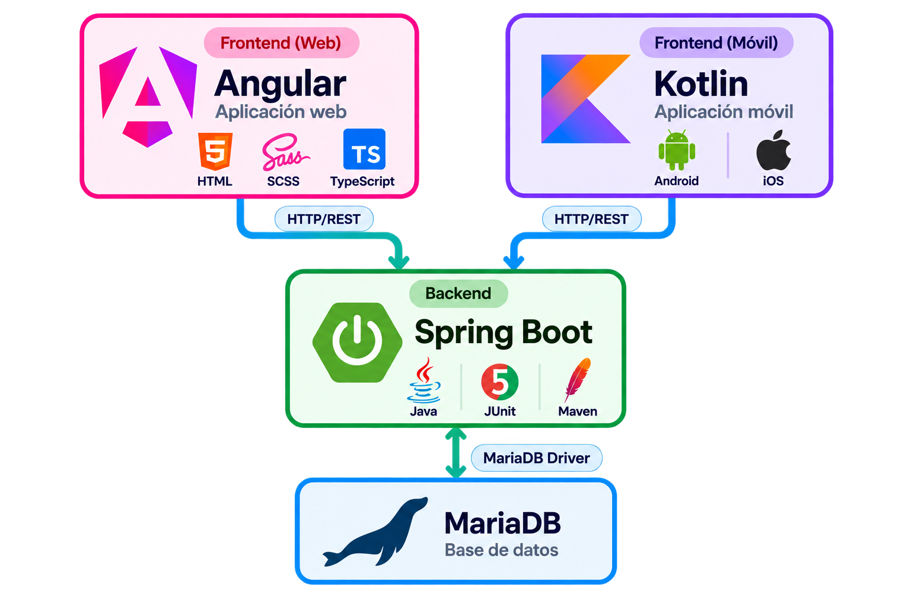
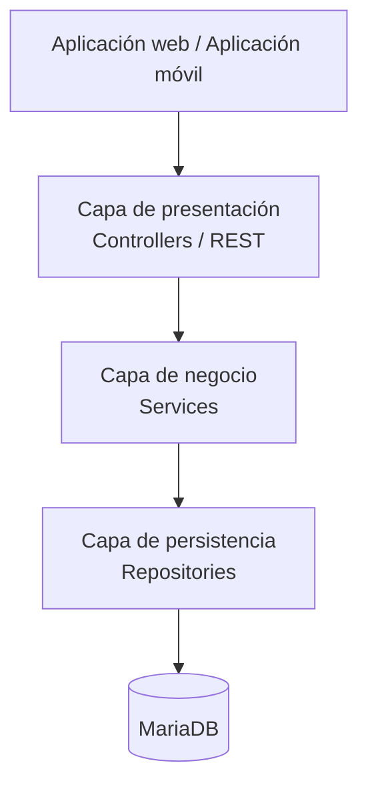

# Inicio

## Arquitectura del sistema

La arquitectura del sistema define los principales componentes que forman Ilicitan Airlines y la comunicación existente entre ellos.

El sistema estará compuesto por una aplicación web, una aplicación móvil, un backend encargado de proporcionar los servicios de la plataforma y una base de datos para el almacenamiento persistente de la información.

Las aplicaciones cliente no accederán directamente a la base de datos. Toda comunicación con el sistema se realizará mediante la API proporcionada por el backend, permitiendo centralizar la lógica de negocio y mantener una estructura común para los distintos clientes.

En la siguiente imagen se muestra la arquitectura propuesta para el desarrollo del proyecto.

| Componente       | Responsabilidad                                                                                                                        |
| ---------------- | -------------------------------------------------------------------------------------------------------------------------------------- |
| Aplicación web   | Proporcionar la interfaz web para consultar vuelos, realizar reservas, gestionar reservas y realizar el check-in.                      |
| Aplicación móvil | Proporcionar las funcionalidades disponibles desde dispositivos móviles, incluyendo la consulta y utilización de tarjetas de embarque. |
| Backend          | Exponer la API REST, aplicar la lógica de negocio, validar operaciones y gestionar el acceso a los datos.                              |
| Base de datos    | Almacenar de forma persistente usuarios, vuelos, reservas, pasajeros, aeronaves, aeropuertos y demás información del sistema.          |

Esta distribución permite que las aplicaciones web y móvil compartan los mismos servicios y datos, evitando duplicar la lógica de negocio en cada cliente.

---

## Arquitectura software

La arquitectura software define la organización interna del backend y la separación de responsabilidades entre sus diferentes componentes.

Para el backend se utilizará una arquitectura por capas, separando la recepción de peticiones, la lógica de negocio y el acceso a los datos. Esta separación permite reducir el acoplamiento entre componentes y facilita el mantenimiento y la ampliación del sistema.

### Capa de presentación

La capa de presentación será responsable de recibir las peticiones HTTP procedentes de las aplicaciones cliente y devolver las respuestas correspondientes.

Esta capa gestionará los endpoints de la API REST, los parámetros de entrada, la validación inicial de las solicitudes y la transformación de los datos intercambiados mediante JSON.

### Capa de negocio

La capa de negocio contendrá las reglas y operaciones propias del sistema.

Será responsable, entre otras operaciones, de comprobar la disponibilidad de vuelos, crear y gestionar reservas, comprobar las condiciones de cancelación y modificación, controlar la disponibilidad de asientos y gestionar el proceso de check-in.

Esta capa no dependerá directamente de la interfaz utilizada por el usuario.

### Capa de persistencia

La capa de persistencia será responsable de realizar las operaciones necesarias sobre la base de datos.

Los repositorios permitirán consultar, crear, modificar y eliminar la información persistida sin que los controladores tengan que conocer directamente la estructura interna de la base de datos.

### Base de datos

MariaDB será el sistema de gestión de bases de datos utilizado para almacenar de forma persistente la información gestionada por la aplicación.

La comunicación con la base de datos se realizará exclusivamente desde la capa de persistencia.

---

## Tecnologías

A continuación se detallan las tecnologías utilizadas durante el desarrollo del proyecto y con las que se está construyendo la aplicación.

### Lenguajes

  

JavaJDK 25 LTS

  

TypeScript7.0.2

  

Kotlin2.4.20

  

HTMLHTML5

  

SassSCSS

  

MariaDB12.3 LTS

### Frameworks

  

Angular21 LTS

  

Spring Boot4.1.1

  

JUnit6.1.3

  

Jetpack Compose1.12.1

  

Compose Multiplatform1.12.0

### IDE's

  

IntelliJ IDEA2026.2.3

  

WebStorm2026.2.2

  

Android StudioQuail 4 | 2026.1.4 Patch 1

  

Visual Studio Code1.138

### Herramientas

  

Maven3.9.16

  

Git2.55.0

  

GitHub2.81.0

  

MariaDB CloudCloud Database

  

FigmaDesign

