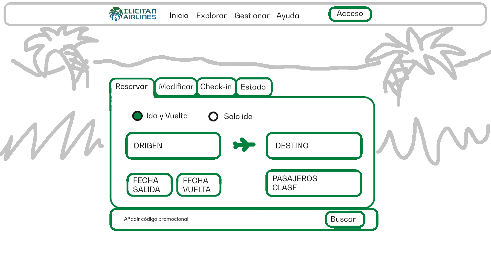
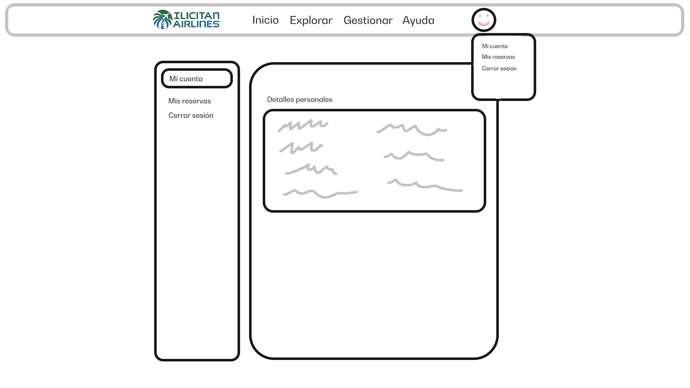
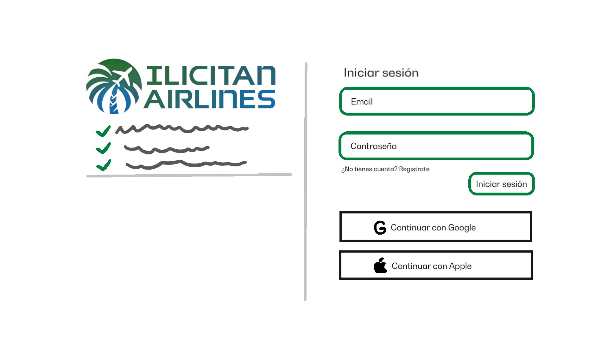
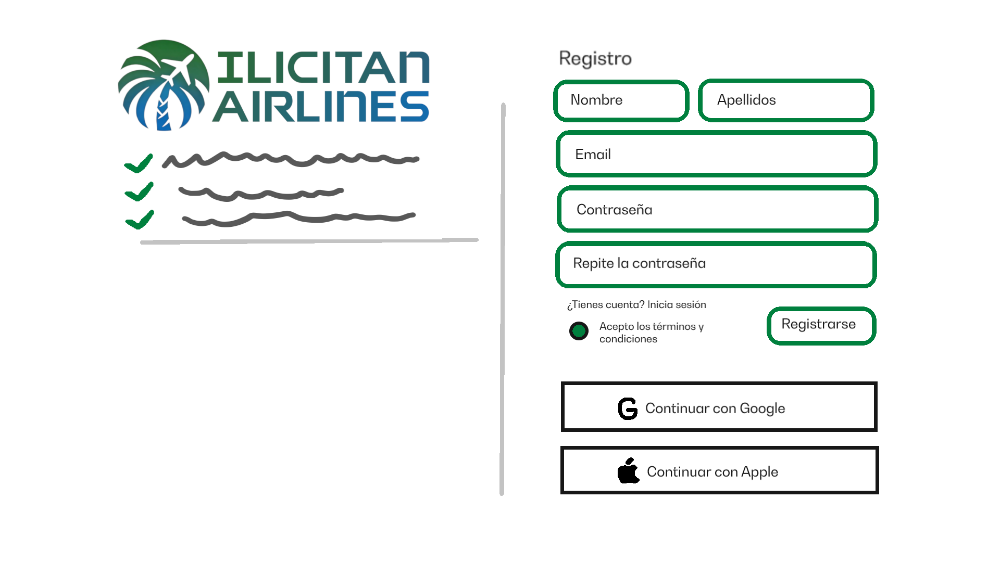
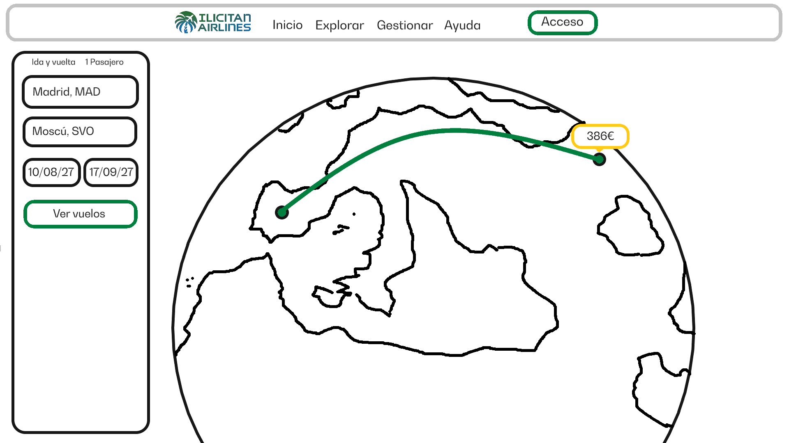
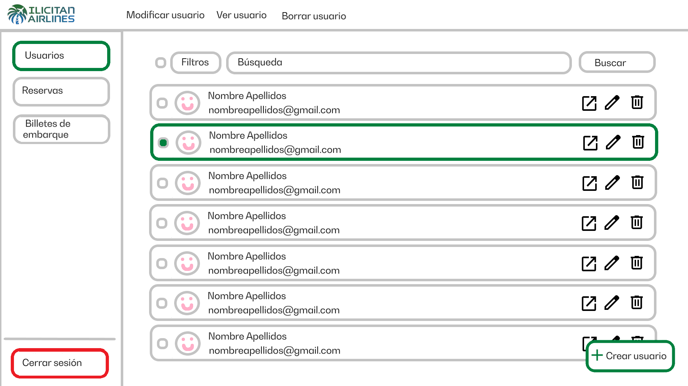
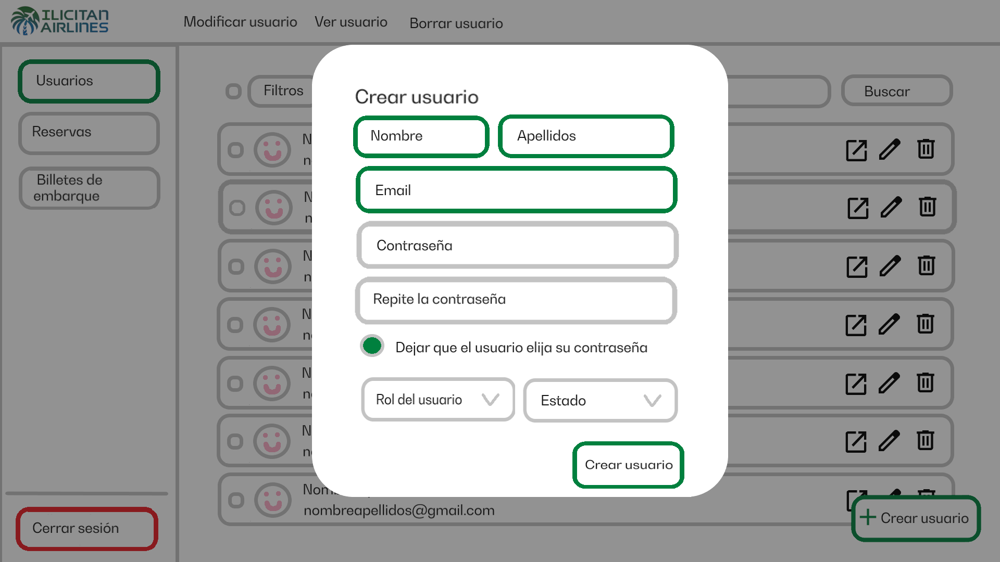
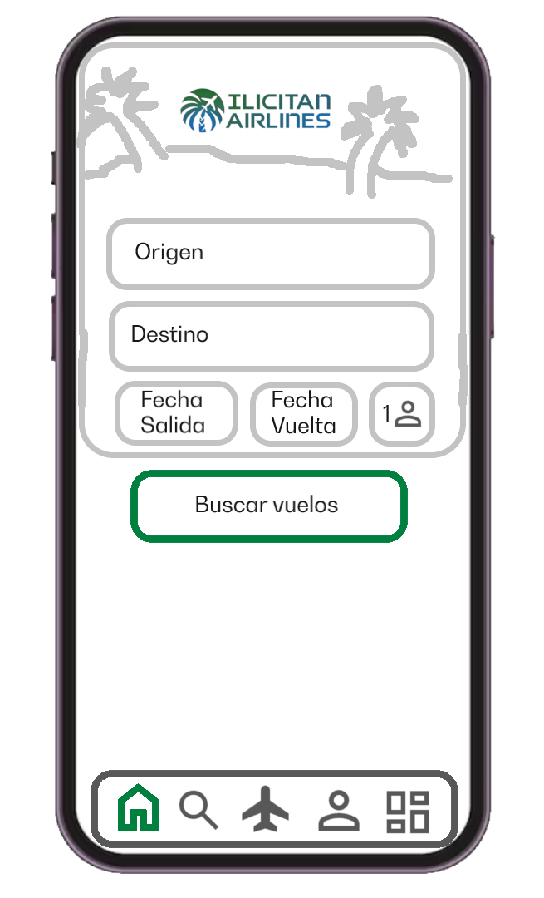
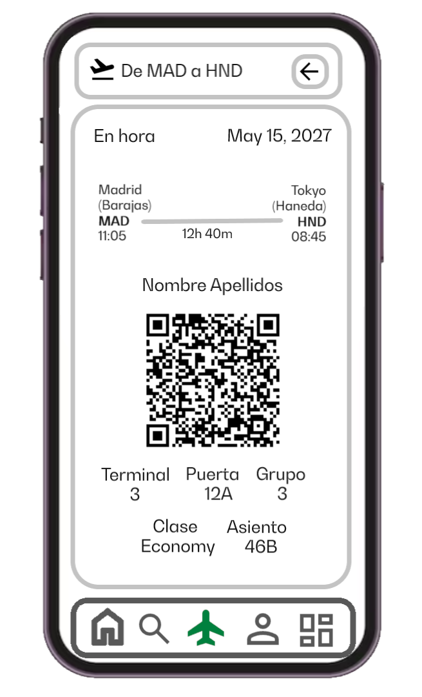

# Bocetos del proyecto

| Campo | Información |
|---|---|
| Actividad | Actividad 2 |
| Nombre | Carlos Tormo Castaño |
| FP | Desarrollo de Aplicaciones Multiplataforma |
| Curso | 2º K |

## Bocetos del usuario web

### Inicio

### Cuenta

### Inicio de sesión

### Registro

### Búsqueda en mapa

## Bocetos del admin web

### Panel de admin

### Crear un usuario

## Bocetos del usuario app

### Inicio

### Billete de embarque

