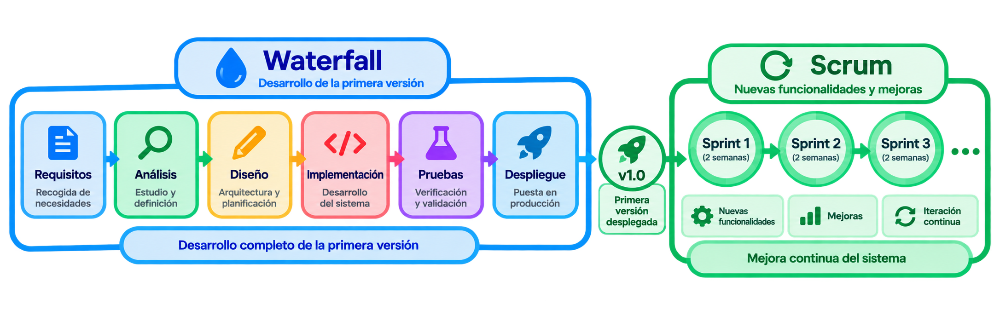

# Inicio

---

  
  

- :material-account:{ .lg .middle } **__Carlos Tormo Castaño__**

    **Autor**

- :material-school:{ .lg .middle } **__IES Severo Ochoa, Elche__**

    **Centro educativo**

- :material-code-braces:{ .lg .middle } **__Desarrollo de Aplicaciones Multiplataforma__**

    **Ciclo formativo**

- :material-calendar:{ .lg .middle } **__2025 - 2027__**

    **Cursos académicos**

---

## Índice

1. [Inicio](./)  
2. [Requisitos](./requirements/index.md)  
  2.1. [Requisitos funcionales](./requirements/requisitos-funcionales.md)  
  2.2. [Requisitos no funcionales](./requirements/requisitos-no-funcionales.md)  
3. [Análisis](./analysis/index.md)
4. [Diseño](./design/index.md)
5. [Implementación](./implementation/index.md)
6. [Pruebas](./testing/index.md)
7. [Despliegue](./deployment/index.md)
8. [Sprints](./sprints/index.md)
9. [Informes](./reports/index.md)

---

## Introducción

Ilicitan Airlines es una compañía aérea ficticia de vuelos comerciales internacionales desarrollada como parte del Proyecto Intermodular de Desarrollo de Aplicaciones Multiplataforma. La aerolínea servirá como contexto para el desarrollo del proyecto, dotándolo de una identidad propia y de una lógica de negocio relacionada con el sector del transporte aéreo comercial.

El proyecto tiene como finalidad desarrollar un sistema destinado a gestionar los principales procesos de una aerolínea. La aplicación permitirá centralizar la información relacionada con la gestión de vuelos, pasajeros y reservas, abarcando el proceso desde que un usuario accede a la plataforma hasta que pasa por la puerta de embarque.

El sistema propuesto consiste en una aplicación full-stack que integrará diferentes tecnologías y conocimientos adquiridos a lo largo de los dos cursos del ciclo de Desarrollo de Aplicaciones Multiplataforma.

---

## Motivación

La propuesta surge de un interés personal por el sector aeronáutico y de una idea que se ha ido consolidando desde el inicio del primer curso de DAM.

El proyecto permite aplicar de forma conjunta las competencias adquiridas durante el ciclo, integrando diferentes tecnologías y desarrollando las operaciones CRUD dentro de un sistema con una lógica de negocio definida.

La propuesta no pretende cubrir un nicho específico del mercado ni ofrecer un servicio comercial real. El objetivo principal es demostrar las competencias adquiridas durante el ciclo mediante el desarrollo de un sistema completo. Además, el proyecto será de código abierto y tendrá una arquitectura modular, de forma que pueda servir como base para que pequeñas aerolíneas desarrollen o adapten sus propios sistemas.

---

## Metodología

Para el desarrollo del proyecto, se implementará una metodología mixta de Waterfall y Scrum.

Esta metodología utilizará Waterfall para el desarrollo de la primera versión del proyecto, mientras que Scrum se utilizará posteriormente para la incorporación de nuevas funcionalidades, implementando control de versiones y un proceso de mejora continua.

El uso de Waterfall permitirá recoger las funcionalidades que se deberán implementar ([Requisitos](./requirements/index.md)). Posteriormente, se realizará el análisis e identificación de las características de la aplicación propuesta ([Análisis](./analysis/index.md)). Una vez obtenida esta información, se procederá a diseñar ([Diseño](./design/index.md)) el proyecto y a realizar su posterior implementación ([Implementación](./implementation/index.md)). A continuación, se realizarán las pruebas necesarias para verificar su correcto funcionamiento ([Pruebas](./testing/index.md)) y, finalmente, se procederá a su despliegue ([Despliegue](./deployment/index.md)).

Una vez desplegada la primera versión, se utilizará Scrum para desarrollar nuevas funcionalidades y realizar mejoras sobre el sistema. El desarrollo se dividirá en Sprints de dos semanas ([Sprints](./sprints/index.md)), durante los cuales se implementará una o varias funcionalidades del proyecto.

---

